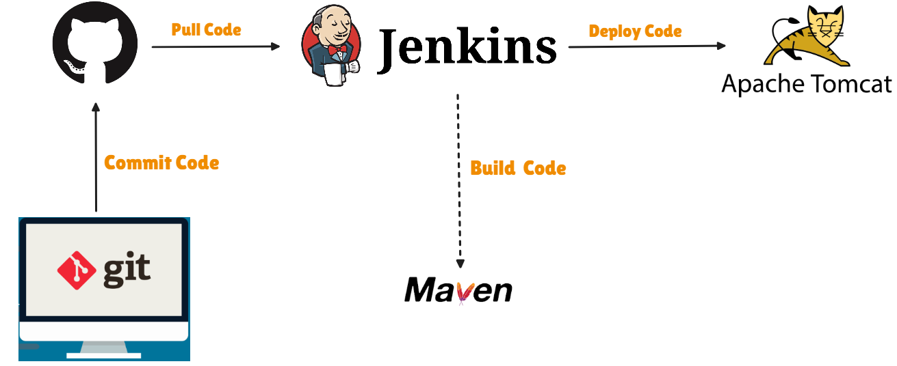
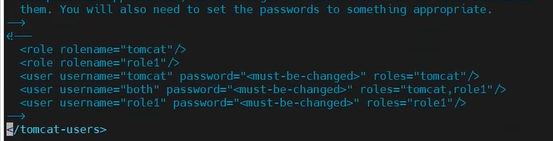
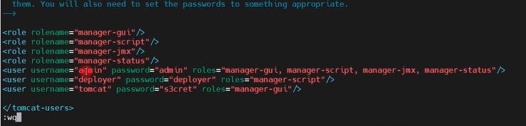

# 🌟“END-TO-END DEVOPS PROJECT USING GITHUB :octocat: , MAVEN, JENKINS, AND TOMCAT SERVER”🌟

- 👨‍💻 Developer writes code on local machine
- 📤 Code is committed and pushed to GitHub using Git
- 🔄 Jenkins pulls the latest code from GitHub repository
- 🛠️ Jenkins triggers Maven to build the project
- 📦 Maven generates the WAR file (build artifact)
- 🚀 Jenkins deploys the WAR file to Apache Tomcat
- 🌐 Application is live and accessible from Tomcat server
## 🔹 1️⃣  INSTALL AND CONFIGURE JENKINS 🔹
**` Go to Aws `**
  👉 EC2 ➡️ Launch Instance ➡️ Name = [JENKINS-SERVER] ➡️ AMI=Amazon Linux(QuickStart) ➡️ Amazon.Linux 2 AMI(HVM)-Kernel 5.10 , SSD Volume Type (Free Tier Eligible) ➡️ Architecture = 64-bit(x86) ➡️ Instance type = t2.micro(Free Tier Eligible) ➡️ Key pair = Createnewone ➡️ Network Settings = Firewall = create security group = ✔️ Allow SSH traffic from 0.0.0.0/0 ➡️ Configure storage = 1x8 GiB gp2 Root Volume = Launch Instance = copy public IPV4 address
  **` Go to MobaXtrem `** *[ is a Windows tool that lets you connect to Linux servers using SSH and also provides a built-in terminal and file transfer in one application. ]*
  👉 Session ➡️ SSH ➡️ Remote host (Paste here IPV4) ➡️ ✔️specify username = ec2-user , Port 22 
  Advanced SSH Settings = ✔️ use private key = ______(Provide private key which is in downloads) ➡️ ✔️x11 = Forwarding ➡️ ✔️Compression ➡️ Remote environment = interactive shell ➡️ SSH-browser-type = SFTP protocol = OK 
  **` Go to Terminal `**
- 👉`[ec2-user@ip-172-31-47-91 ~]$ sudo su `
- 👉`[root@ip-172-31-47-91 ec2-user]# cd ~`
- 🔗 https://www.jenkins.io/doc/tutorials/tutorial-for-installing-jenkins-on-AWS/ (for reference use this link)
- Updates all installed packages to the latest version. It may not remove old packages.
  👉`[root@ip-172-31-47-91 ~]# sudo yum update -y `
- This is used to add the Jenkins repo to our system
  👉`[root@ip-172-31-47-91 ~]# sudo wget -O /etc/yum.repos.d/jenkins.repo \  https://pkg.jenkins.io/redhat-stable/jenkins.repo`
- This command tells your system to trust Jenkins packages so you can install them safely.
  👉`[root@ip-172-31-47-91 ~]# sudo rpm --import https://pkg.jenkins.io/redhat-stable/jenkins.io-2023.key`
- Updates all installed packages to the latest version and can remove obsolete packages if needed.
  👉`[root@ip-172-31-47-91 ~]# sudo yum upgrade`
- Amazon Linux has only basic software,so adding EPEL repo lets U easily install extra useful packages like htop, nginx, and dev tools using yum.
- EPEL =  Extra Packages for Enterprise Linux
  👉`[root@ip-172-31-47-91 ~]# amazon-linux-extras install epel`
- “Install Java 11 on Amazon Linux automatically without asking me questions.”
  👉`[root@ip-172-31-47-91 ~]# sudo amazon-linux-extras install java-openjdk11 -y`
- “Install Amazon’s Java 11 automatically on my system.”
  👉`[root@ip-172-31-47-91 ~]# yum install java-11-amazon-corretto -y`
- “Install Jenkins automatically on my system without asking me any questions.”
  👉`[root@ip-172-31-47-91 ~]# yum install jenkins -y`
- “Make Jenkins start automatically whenever my system turns on.”
  👉`[root@ip-172-31-47-91 ~]# sudo systemctl enable jenkins`
- “Turn on Jenkins right now so I can use it.”
  👉`[root@ip-172-31-47-91 ~]# sudo systemctl start jenkins`
- Shows which version of Java is installed and running on your system. `java --version`
- Shows which version of Java compiler is installed. `javac --version`
  👉`[root@ip-172-31-47-91 ~]# systemctl status jenkins`
### CHANGING HOSTNAME OF THE SERVER
👉`[root@ip-172-31-47-91 ~]# hostname JENKINS-SERVER` &nbsp;&nbsp;&nbsp;&nbsp;&nbsp;&nbsp;&nbsp;&nbsp;   [meaning = “Rename my server to JENKINS-SERVER.”]
  👉`[root@ip-172-31-47-91 ~]# cd /etc`
  👉`[root@ip-172-31-47-91 etc]# vim hostname` &nbsp;&nbsp;&nbsp;&nbsp; [ Inside file remove everything just write `JENKINS-SERVER` & :wq ]
  👉`[root@ip-172-31-47-91 etc]# init 6` &nbsp;&nbsp;`[Press R]` &nbsp;&nbsp;&nbsp;&nbsp;[ This cmd is to reboot server ]
### JENKINS WORKS ON PORT 8080
**` Go to Aws `** ➡️EC2➡️ security ➡️ securitygroups ➡️ Inbound rules ➡️ Edit Inbound Rules➡️ Add rule ➡️ portrange=8080 ➡️ source=AnywhereIPV4 ➡️ Type=customTCP ➡️ SaveRules
### JENKINS INSTALLATION
Copy public IPV4 Address ,paste in browser➡️ 172-31-47-91:8080 ➡️ copy path of password shown  
**Go to terminal**   👉`[ec2-user@JENKINS-SERVER ~]$ sudo su`
  👉`[root@JENKINS-SERVER ec2-user]# cat ______paste the path of password` 
 **Go to JENKINS GUI**  Install suggested plugins ➡️ username _____  ➡️ Password ______  ➡️ Fullname ______  ➡️ Save & Continue ➡️ Start using Jenkins
  😏So here we completed Jenkins setup on EC2 Instance & on the same server we will be configuring the maven also in next step.
## 🔹 2️⃣ INSTALL AND CONFIGURE THE MAVEN 🔹
🔗 https://maven.apache.org/download.cgi ➡️ Binary tar.gz archive = 🔗apache-maven-3.9.12-bin.tar.gz = Right click = Copy link address
  👉`[ec2-user@JENKINS-SERVER ~]$ sudo su`
  👉`[root@JENKINS-SERVER ec2-user]# cd ~`
  👉`[root@JENKINS-SERVER ~]# cd /opt`
  👉`[root@JENKINS-SERVER opt]#  wget _____paste here the copied path`
  👉`[root@JENKINS-SERVER opt]# ls`
  O/P = apache-maven-3.9.3-bin.tar.gz(This is now downloaded file)&nbsp;&nbsp;&nbsp;&nbsp;&nbsp;&nbsp;aws &nbsp;&nbsp;&nbsp;&nbsp;&nbsp;&nbsp;rh
  👉`[root@JENKINS-SERVER opt]# tar -xzvf apache-maven-3.9.3-bin.tar.gz` &nbsp;&nbsp;(This is to exctract the file)
  👉`[root@JENKINS-SERVER opt]# ls`
  O/P = apache-maven-3.9.3&nbsp;&nbsp;&nbsp;&nbsp;&nbsp;&nbsp;apache-maven-3.9.3-bin.tar.gz&nbsp;&nbsp;&nbsp;&nbsp;&nbsp;&nbsp;&nbsp;&nbsp;aws &nbsp;&nbsp;&nbsp;&nbsp;&nbsp;&nbsp;rh
  👉`[root@JENKINS-SERVER opt]# mv apache-maven-3.9.3 maven`&nbsp;&nbsp;&nbsp;&nbsp;&nbsp;&nbsp;(Move this folder to new maven folder)
  👉`[root@JENKINS-SERVER opt]# ls`
  O/P = apache-maven-3.9.3-bin.tar.gz&nbsp;&nbsp;&nbsp;&nbsp;&nbsp;&nbsp;&nbsp;&nbsp;aws&nbsp;&nbsp;&nbsp;&nbsp;&nbsp;&nbsp;&nbsp;&nbsp;maven&nbsp;&nbsp;&nbsp;&nbsp;&nbsp;&nbsp;&nbsp;&nbsp;rh
  👉`[root@JENKINS-SERVER opt]# cd maven/`
  👉`[root@JENKINS-SERVER maven]# ls`
  O/P = bin&nbsp;&nbsp;&nbsp;&nbsp; boot&nbsp;&nbsp;&nbsp;&nbsp; conf&nbsp;&nbsp;&nbsp;&nbsp; lib&nbsp;&nbsp;&nbsp;&nbsp; LICENSE&nbsp;&nbsp;&nbsp;&nbsp; NOTICE&nbsp;&nbsp;&nbsp;&nbsp; README.txt
  👉`[root@JENKINS-SERVER maven]# cd bin/`
  👉`[root@JENKINS-SERVER bin]# ./mvn -v` (O/P = maven & java has installed)
  👉`[root@JENKINS-SERVER bin]# cd ..`
  👉`[root@JENKINS-SERVER maven]# ./mvn -v`
  bash:&nbsp;&nbsp;&nbsp;&nbsp; ./mvn:&nbsp;&nbsp;&nbsp;&nbsp; No such file or directory 😨
  Here we have gone outside of bin folder & checked maven is there or not it was showing error 
  So to Run the maven from anywhere on the server we need to setup the environment variables 
  👉`[root@JENKINS-SERVER maven]# cd ~`
  👉`[root@JENKINS-SERVER ~]# pwd` &nbsp;&nbsp;&nbsp;&nbsp;(O/P = /root)
  👉`[root@JENKINS-SERVER ~]# ll -a` &nbsp;&nbsp;&nbsp;&nbsp; (we need to edit .bash_profile)
  👉`[root@JENKINS-SERVER ~]# vim .bash_profile`
  Inside file below fi line start writing
- `M2_HOME=/opt/maven` &nbsp;&nbsp;&nbsp;&nbsp;&nbsp;&nbsp;&nbsp;&nbsp; (meaning = Path for maven)
- `M2=/opt/maven/bin` &nbsp;&nbsp;&nbsp;&nbsp;&nbsp;&nbsp;&nbsp;&nbsp; (meaning = Path for Binary folder for maven)
- `JAVA_HOME=_____  Paste the path here `
- PATH=$PATH:$HOME/bin`:$JAVA_HOME:$M2_HOME:$M2` &nbsp;&nbsp;&nbsp;&nbsp;&nbsp;&nbsp;&nbsp;&nbsp; (:wq)        
**` How to Copy `**
  Go to terminal upper side (🔧2. 3.11.122.97(ec2-user)) right click = Duplicate tab
  👉` [ec2-user@JENKINS-SERVER ~]$ sudo su`
  👉` [root@JENKINS-SERVER ec2-user]# find / -name java-11*`
  you will get path of java [/usr/lib/jvm/java-11-openjdk-11.0.19.0.7-1.amzn2.0.1.x86_64] copy this path

  👉`[root@JENKINS-SERVER ~]# echo $PATH`
  O/P = /sbin:/bin/usr/sbin:/usr/bin &nbsp;&nbsp;&nbsp;&nbsp;&nbsp;&nbsp;&nbsp;&nbsp; (still it was not showing the maven & Java path)
  👉`[root@JENKINS-SERVER ~]# source .bash_profile` &nbsp;&nbsp;&nbsp;&nbsp;&nbsp;&nbsp;&nbsp;&nbsp; (This will save the changes made to .bash_profile)
  👉`[root@JENKINS-SERVER ~]# echo $PATH` &nbsp;&nbsp;&nbsp;&nbsp;&nbsp;&nbsp;&nbsp;&nbsp; (here it was showing the complete path)
  👉`[root@JENKINS-SERVER ~]# mvn -v` &nbsp;&nbsp;&nbsp;&nbsp;&nbsp;&nbsp;&nbsp;&nbsp; (Now i can run maven cmd anywhere from the server)
  😏Till here we have setup the maven we have configured the maven on the server, on the same server on which we have our Jenkins.
  😏Now we need to install the Maven plugin on the Jenkins & then we need to configure the Jenkins for the Maven
## 🔹 3️⃣ INSTALL MAVEN PLUGIN AND CONFIGURE JENKINS FOR MAVEN 🔹
**` Go to Aws `** ➡️ copy public IPV4 address:8080 = paste in browser 
  **` Go to Manage Jenkins `** ➡️ plugins ➡️ Available Plugins (search=✔️maven Integration) Install without restart 
  &nbsp;&nbsp;&nbsp;&nbsp;● Meaning=It will Install dependencies,& plugin has been installed to Maven
  **` Go to Manage Jenkins `** ➡️ Tools 
  &nbsp;&nbsp;&nbsp;&nbsp;● JDK = Add JDK = (Name=java11) = (JAVA_HOME=/usr/lib/jvm/java-11-openjdk-11.0.19.0.7-1.amzn2.0.1.x86_64)copythislinefrom above
  &nbsp;&nbsp;&nbsp;&nbsp;● Maven = Add Maven = (Name=maven) = untick [ ] install automatically = MAVEN_HOME=/opt/maven = Apply = Save
  **` Go to Manage Jenkins `** ➡️ plugins ➡️ Installed Plugins ➡️ (search=github)
  &nbsp;&nbsp;&nbsp;&nbsp;● Disable = Github Branch Source Plugin
  &nbsp;&nbsp;&nbsp;&nbsp;● Enable = Github Plugin = click on (Restart Once No Jobs Are Running)
  **Go to terminal** 
  👉`[root@JENKINS-SERVER ~]# yum install git`
  **Go to Jenkins GUI & Login again** 
  😏 Now we need to create one test project & we want to test the build 
  + New item ➡️ Name = Test-Maven-Build ➡️ Maven project = ok ➡️ Description = Test Maven Build ➡️ Source Code Management = Git ➡️ Repository URL = https://github.com/Venkat474/registration-app.git ➡️ Credentials = none ➡️ Branch Specifier = [*/main] Always go & check this in ur Github ➡️ Build = (Root POM = pom.xml) = (Goals and options = clean install) ➡️ Apply ➡️ Save    **Click on Build Now** &nbsp;&nbsp;&nbsp;&nbsp;(O/P=Success Here it download all dependencies for build)
  Dashboard > Test-Maven-Build = Workspace =webapp = target (Here we see `webapp.war` this is the final build file) 
## 🔹 4️⃣ SETUP TOMCAT SERVER 🔹
**` Go to Aws `**
  👉 EC2 ➡️ Launch Instance ➡️ Name = [Tomcat-Server] ➡️ AMI=Amazon Linux(QuickStart) ➡️ Amazon.Linux 2 AMI(HVM)-Kernel 5.10 , SSD Volume Type (Free Tier Eligible) ➡️ Architecture = 64-bit(x86) ➡️ Instance type = t2.micro(Free Tier Eligible) ➡️ Key pair = selectoldone ➡️ Network Settings = Firewall = create security group = ✔️ Allow SSH traffic from 0.0.0.0/0 ➡️ Configure storage = 1x8 GiB gp2 Root Volume = Launch Instance
### TOMCAT WORKS ON PORT 8080
**` Go to Aws `** ➡️EC2➡️ security ➡️ securitygroups ➡️ Inbound rules ➡️ Edit Inbound Rules➡️ Add rule ➡️ portrange=8080 ➡️ source=AnywhereIPV4 ➡️ Type=customTCP ➡️ SaveRules = Copy Public IPV4 address of Tomcat-Server
  **` Go to MobaXtrem `**
  👉 Session ➡️ SSH ➡️ Remote host (Paste here IPV4 of Tomcat-Server) ➡️ ✔️specify username = ec2-user , Port 22 
  Advanced SSH Settings = ✔️ use private key = ______(Provide private key which is in downloads) ➡️ ✔️x11 = Forwarding ➡️ ✔️Compression ➡️ Remote environment = interactive shell ➡️ SSH-browser-type = SFTP protocol = OK 
  👉`[ec2-user@ip-172-31-37-17 ~]$ sudo su`
  👉`[root@ip-172-31-37-17 ec2-user]# cd ~`
  👉`[root@ip-172-31-37-17 ~]# pwd`&nbsp;&nbsp;&nbsp;&nbsp;&nbsp;&nbsp;&nbsp;&nbsp;(O/P = /root)
  👉`[root@ip-172-31-37-17 ~]# amazon-linux-extras install java-openjdk11` &nbsp;&nbsp;&nbsp;&nbsp;&nbsp;&nbsp;&nbsp;&nbsp;(Meaning = “Install Java 11 on Amazon Linux.”)
  👉`[root@ip-172-31-37-17 ~]# java --version` 
  🔗 https://tomcat.apache.org/download-90.cgi &nbsp;&nbsp;&nbsp;&nbsp;&nbsp;&nbsp;&nbsp;&nbsp;  (In Binary Distribution section there is file called `tar.gz (pgp, sha512)` Right click + Copy link address )
  👉`[root@ip-172-31-37-17 ~]# cd /opt`
  👉`[root@ip-172-31-37-17 opt]# wget ___Paste copied path`
  👉`[root@ip-172-31-37-17 opt]# ls`
  apache-tomcat-9.0.76.tar.gz(This is now downloaded file)&nbsp;&nbsp;&nbsp;&nbsp;&nbsp;&nbsp;&nbsp;&nbsp;aws&nbsp;&nbsp;&nbsp;&nbsp;&nbsp;&nbsp;&nbsp;&nbsp;rh
  👉`[root@ip-172-31-37-17 opt]# tar -xvzf apache-tomcat-9.0.76.tar.gz`  &nbsp;&nbsp;&nbsp;&nbsp;(This is to exctract the file)
  apache-tomcat-9.0.76&nbsp;&nbsp;&nbsp;&nbsp;&nbsp;&nbsp;&nbsp;apache-tomcat-9.0.76.tar.gz&nbsp;&nbsp;&nbsp;&nbsp;&nbsp;&nbsp;&nbsp;aws&nbsp;&nbsp;&nbsp;&nbsp;&nbsp;&nbsp;&nbsp;rh 
  👉`[root@ip-172-31-37-17 opt]# mv apache-tomcat-9.0.76 tomcat`
  👉`[root@ip-172-31-37-17 opt]# ls`
  apache-tomcat-9.0.76.tar.gz&nbsp;&nbsp;&nbsp;&nbsp;&nbsp;&nbsp;&nbsp;aws&nbsp;&nbsp;&nbsp;&nbsp;&nbsp;&nbsp;&nbsp;rh&nbsp;&nbsp;&nbsp;&nbsp;&nbsp;&nbsp;&nbsp;tomcat
  👉`[root@ip-172-31-37-17 opt]# cd tomcat`
  👉`[root@ip-172-31-37-17 tomcat]# cd bin`
  👉`[root@ip-172-31-37-17 bin]# ls`&nbsp;&nbsp;&nbsp;&nbsp;&nbsp;&nbsp;&nbsp;(Here there is one file called startup.sh we need to start the tomcat)
  👉`[root@ip-172-31-37-17 bin]# ./startup.sh`&nbsp;&nbsp;&nbsp;&nbsp;&nbsp;&nbsp;&nbsp;(Now tomcat has been started in our server)
  Copy Public IPV4 address of Tomcat-Server = paste in browser _________:8080 = Go to Manager App option (here it is giving error 😑`403 Access Denied`)
  💡 To resolve this we need to edit `context.xml` file
  👉`[root@ip-172-31-37-17 bin]# cd ..`
  👉`[root@ip-172-31-37-17 tomcat]# find / -name context.xml`&nbsp;&nbsp;&nbsp;&nbsp;&nbsp;&nbsp;&nbsp;(Here last 2 files we need to edit as shown below)
 1./opt/tomcat/webapps/host-manager/META-INF/context.xml
 2./opt/tomcat/webapps/manager/META-INF/context.xml
  👉`[root@ip-172-31-37-17 tomcat]# vim /opt/tomcat/webapps/host-manager/META-INF/context.xml`
  &nbsp;&nbsp;&nbsp;&nbsp;● As you see in valve className line here it is only allowing through localhost so we need to comment these 2 lines as shown below
  &nbsp;&nbsp;&nbsp;&nbsp;● `<!--` <Valve className=............................................................
  &nbsp;&nbsp;&nbsp;&nbsp;●    ............................................................................/> `-->`&nbsp;&nbsp;&nbsp;&nbsp; wq:&nbsp;&nbsp;&nbsp;&nbsp;(This is how we comment in xml file)
  👉`[root@ip-172-31-37-17 tomcat]# vim /opt/tomcat/webapps/manager/META-INF/context.xml`
  &nbsp;&nbsp;&nbsp;&nbsp;● `<!--` <Valve className=............................................................
  &nbsp;&nbsp;&nbsp;&nbsp;●    ............................................................................/> `-->`&nbsp;&nbsp;&nbsp;&nbsp; wq:
  &nbsp;&nbsp;&nbsp;&nbsp; Now we need to reboot the Tomcat Server
  👉`[root@ip-172-31-37-17 tomcat]# cd bin/`
  👉`[root@ip-172-31-37-17 bin]# ./shutdown.sh`
  👉`[root@ip-172-31-37-17 bin]# ./startup.sh`
  &nbsp;&nbsp;&nbsp;&nbsp;● Go to Tomcat GUI page & refresh = Go to Manager App = It will ask Username & Password just cancel it = 😑`401 Unauthorized`
  &nbsp;&nbsp;&nbsp;&nbsp;● 💡To resolve this we have to create the credentials in Tomcat Server to access this
  👉`[root@ip-172-31-37-17 bin]# cd ..`
  👉`[root@ip-172-31-37-17 tomcat]# cd conf/`
  👉`[root@ip-172-31-37-17 conf]# ls`&nbsp;&nbsp;&nbsp;&nbsp;&nbsp;&nbsp;&nbsp;&nbsp;(we need to edit this file `tomcat-users.xml`)
  👉`[root@ip-172-31-37-17 conf]# vim tomcat-users.xml`
  &nbsp;&nbsp;&nbsp;&nbsp;● Here i need to go to end of this file so click `(Shift + G)` 
  &nbsp;&nbsp;&nbsp;&nbsp;● At downwards u see few users are there but they are commented Remove everything which are there inside this comment `<--` & `-->` 
  
  &nbsp;&nbsp;&nbsp;&nbsp;● Provide 3 new user details as shown below and (:wq) 🔗 [Open role-username.txt](role-username.txt)
  
  &nbsp;&nbsp;&nbsp;&nbsp; 🔲 Allows access to Tomcat Manager web page (GUI).
  &nbsp;&nbsp;&nbsp;&nbsp; 🔲 Allows access to Tomcat Manager using scripts/CLI.
  &nbsp;&nbsp;&nbsp;&nbsp; 🔲 Allows access to JMX monitoring tools.
  &nbsp;&nbsp;&nbsp;&nbsp; 🔲 Allows access to view server status only.
  &nbsp;&nbsp;&nbsp;&nbsp; 🔲 Creates an admin user with full manager access.
  &nbsp;&nbsp;&nbsp;&nbsp; 🔲 Creates a deployer user who can deploy apps using scripts only.
  &nbsp;&nbsp;&nbsp;&nbsp; 🔲 Creates a tomcat user who can access the web UI only.
  👉`[root@ip-172-31-37-17 conf]# cd ..`
  👉`[root@ip-172-31-37-17 tomcat]# cd bin/`
  👉`[root@ip-172-31-37-17 bin]# ./shutdown.sh`
  👉`[root@ip-172-31-37-17 bin]# ./startup.sh`
  &nbsp;&nbsp;&nbsp;&nbsp;● Go to Tomcat GUI page & refresh = Go to Manager App = It will ask Username(admin) & Password(admin) (Now i have login to the Tomcat server) 
## 🔹 5️⃣ INTEGRATING TOMCAT SERVER WITH JENKINS 🔹
Here we need to Integrate the Tomcat with Jenkins there is no Predefined Plugin for the Tomcat Server ,
  We need to install ,deploy to container plugin then we need to configure Tomcat Server with the credentials
  **`Go to Jenkins GUI & Login again`** 
  **` Go to Manage Jenkins `** ➡️ plugins ➡️ Available Plugins (search=✔️Deploy to container) Install without restart 
  🔲 Now we need to add the credentials of the Tomcat Server to the Jenkins
  **` Go to Manage Jenkins `** ➡️ under security = Credentials ➡️ System ➡️ Global credentials ➡️ `+ Add Credentials` 
  🔲 Kind = username with password 
  🔲 username = deployer (This already we have created in above photo)
  🔲 Password = deployer
  🔲 ID = tomcat-credentials (Description = tomcat-credentials) Create
  **` Go to Dashboard `** ➡️ `+ Add item` ➡️ Name=BuildAndDeployToTomcat ➡️ Maven Project ➡️ Ok
  Description = Build And Deploy To Tomcat Server ➡️ Source Code Management = git 
  ➡️ Repository Url = https://github.com/Venkat474/registration-app.git ➡️ Branch = `*/main` 
  Build ➡️ Root POM = pom.xml ➡️ Goals and options = clean install 
  Post-build Actions ➡️ Add post-build action ➡️ select Deploy war/ear to a container 
  ➡️ WAR/EAR files = `**/*.war` **(If it finds the any dot war file inside the build directory of workspace it will deploy it)** 
  ➡️ Containers = Add Containers = Tomcat 8.xRemote ➡️ Credentials = [deployer/******(tomcat-credentials)] ➡️ Tomcat URL = https://3.110.225.113:8080/ (copy from browser) ➡️ Apply = Save
  ⚠️ Before U click on Build Now close the Tomcat GUI tab from browser otherwise it will fail
  Now Job has created & Now run the Job `Build Now` = O/P Success
  open IP of tomcat server https://3.110.225.113:8080/ = Manager App = Here u see `/webapp` This is our application deployed through Jenkins ,Click on it U see your application (This is registration App). 
### AUTOMATE BUILD AND DEPLOY USING POLL SCM AND VERIFY CI/CD 
**` Go to Jenkins GUI `** Dashboard = BuildAndDeployToTomcat = Configure = under Build Triggers(✔️ Poll SCM)schedule=***** = Apply = Save
  **(This means every minute it will check the githubrepository if any change is there in this repo then it will trigger the pipeline)**
  ⚠️ Using Poll SCM it will only monitor the github repo not the complete account 
  Now we need to test our pipeline 
  **` Go to Github repo(Registration-app) `** ➡️ webapp ➡️src/main/webapp➡️index.jsp=edit this file
  🔲 New user Register for Devops Learning `at virtualTechBox` = commit changes
  ⚠️ close the Tomcat GUI tab from browser otherwise it will fail
  Go to Jenkins job within a min it will automatically triggered the pipeline / Build and Deploy job [O/P = Success]
  open IP of tomcat server https://3.110.225.113:8080/ = Manager App = `/webapp` = u can see changes 
<h1> Moral </h1>

### 🚀 Automated CI/CD Pipeline using Jenkins, Maven & Tomcat
Using this setup, you create a **fully automated CI/CD pipeline 🔄.**
- 👉 Whenever you make any change in the GitHub repository (from your local system using Git):
- 🔔 **Jenkins job is triggered automatically**
- 🔨 Jenkins **builds the project using Maven**
- 📦 The application is **packaged**
- 🚀 Jenkins **deploys the application to the Tomcat Server**
 All these steps happen **automatically without manual work 🤖.**
